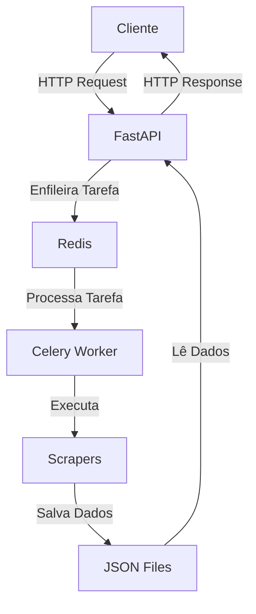
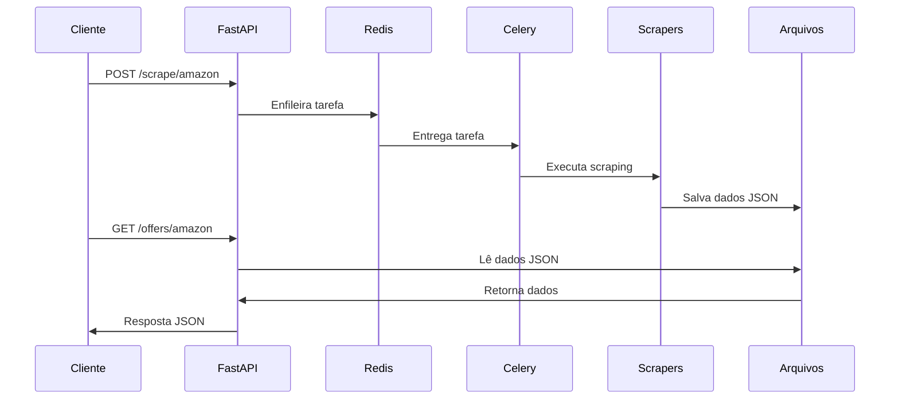

## Projeto de Web Scraping e API

### 📋 Visão Geral

Este projeto implementa um sistema de web scraping para coletar dados de produtos da Amazon e Magazine Luiza, com uma API para consulta dos dados coletados. O sistema utiliza uma arquitetura distribuída com FastAPI, Celery e Redis, tudo containerizado com Docker para garantir portabilidade e facilidade de implantação.

### 🏗️ Arquitetura do Sistema

A arquitetura do sistema é composta por três componentes principais:

- API (FastAPI): Interface HTTP para iniciar tarefas de scraping e consultar dados
- Worker (Celery): Processamento assíncrono das tarefas de scraping
- Broker (Redis): Gerenciamento de filas de tarefas entre a API e os workers

O diagramade arquitetura abaixo ilustra o app:



📁 Estrutura de Pastas
```

project/
├── app/
│   ├── __init__.py
│   ├── api.py            # Endpoints da API FastAPI
│   ├── main.py           # Configuração principal da aplicação
│   ├── tasks.py          # Tarefas assíncronas do Celery
│   └── scrapers/
│       ├── __init__.py
│       ├── base_scraper.py     # Classe base para scrapers
│       ├── amazon_scraper.py   # Implementação do scraper da Amazon
│       └── magalu_scraper.py   # Implementação do scraper da Magazine Luiza
├── data/                 # Diretório onde os dados são salvos
│   ├── amazon_offers.json
│   └── magalu_offers.json
├── debug/                # Diretório para arquivos de debug
├── Dockerfile            # Configuração do container Docker
├── docker-compose.yml    # Configuração dos serviços Docker
└── requirements.txt      # Dependências do projeto
```


## 🚀 Como Executar o Projeto
### Pré-requisitos
- Docker instalado
- Docker Compose instalado (geralmente incluído com o Docker Desktop)
  
### Passos para Execução
- Clone o repositório
- Inicie os containers com Docker Compose
- docker-compose up --build

## Este comando irá:

- Construir as imagens Docker necessárias
- Iniciar três containers:
- web: Servidor FastAPI na porta 8000
- worker: Worker do Celery para processamento assíncrono
- redis: Broker de mensagens para comunicação entre serviços

## Acesse a documentação da API

- Abra seu navegador e acesse:

- http://localhost:8000/docs

- Você verá a interface Swagger UI com todos os endpoints disponíveis.

## Para verificar os logs:

- docker-compose logs -f

## Parando os Containers
- docker-compose down

## 📡 Endpoints da API

### Endpoints de Scraping

| Método | Endpoint | Descrição |
|--------|----------|-----------|
| POST | `/scrape` | Inicia o scraping de todas as fontes |
| POST | `/scrape/amazon` | Inicia o scraping apenas da Amazon |
| POST | `/scrape/magalu` | Inicia o scraping apenas da Magazine Luiza |

### Endpoints de Consulta

| Método | Endpoint | Descrição |
|--------|----------|-----------|
| GET | `/offers` | Retorna todas as ofertas coletadas |
| GET | `/offers/amazon` | Retorna apenas as ofertas da Amazon |
| GET | `/offers/magalu` | Retorna apenas as ofertas da Magazine Luiza |

## 🔄 Fluxo de Execução




## Inicialização:

- Os containers Docker são iniciados
- O servidor FastAPI começa a escutar na porta 8000
- O worker Celery se conecta ao Redis

### Scraping:

- Um cliente faz uma requisição POST para /scrape/amazon
- A API enfileira uma tarefa no Redis
- O worker Celery recebe a tarefa
- O scraper da Amazon é executado
- Os dados coletados são salvos em data/amazon_offers.json

### Consulta:

- Um cliente faz uma requisição GET para /offers/amazon
- A API lê os dados do arquivo data/amazon_offers.json
- A API retorna os dados em formato JSON


## 📊 Formato dos Dados

Os dados são salvos em arquivos JSON com a seguinte estrutura:
```
  {
    "nome": "Nome do Produto",
    "preco_vista": "R$ 99,90",
    "preco_prazo": "10x de R$ 9,99",
    "disponivel": true,
    "url": "https://www.exemplo.com/produto",
    "timestamp": "2025-03-30T12:34:56.789"
  }
```

## ⚠️ Considerações Técnicas
### Desafios de Web Scraping

O projeto implementa técnicas para lidar com os desafios comuns de web scraping:

- Estrutura dinâmica das páginas: Os scrapers são projetados para serem resilientes a mudanças na estrutura do HTML.
- Proteções anti-bot: O scraper da Magazine Luiza pode encontrar CAPTCHAs e outras proteções. O sistema salva o HTML para diagnóstico.
- Tratamento de erros: Implementação robusta de tratamento de exceções para garantir que falhas em um scraper não afetem o sistema como um todo.
  
### Melhorias Potenciais

Em um ambiente de produção, seria recomendável implementar:

- Banco de dados: Substituir o armazenamento em arquivos JSON por um banco de dados como PostgreSQL ou MongoDB.
- Técnicas avançadas de scraping: Utilizar Selenium/Playwright para sites com proteções anti-bot(ou Agentes de IA).
- Testes automatizados: Implementar testes unitários e de integração para garantir a qualidade do código.

## 🔍 Depuração

O sistema inclui recursos para facilitar a depuração:

- Logs detalhados: Todos os componentes geram logs informativos.
- Arquivos de debug: O HTML bruto das páginas é salvo na pasta debug/ para análise.
- Documentação interativa: A interface Swagger permite testar os endpoints diretamente no navegador.

### Para visualizar os logs em tempo real:
```
docker-compose logs -f
```

## 📝 Conclusão

Este projeto demonstra a implementação de um sistema distribuído para web scraping e disponibilização de dados via API. A arquitetura escolhida prioriza:

- Escalabilidade: Componentes desacoplados que podem ser escalados independentemente.
- Manutenibilidade: Código organizado e modular, facilitando extensões e modificações.
- Robustez: Tratamento adequado de erros e falhas.
- Facilidade de uso: Documentação clara e interface intuitiva.

A combinação de FastAPI, Celery e Docker cria uma solução moderna e eficiente para coleta e disponibilização de dados de múltiplas fontes. Uma combinação bem robusta de stack.
